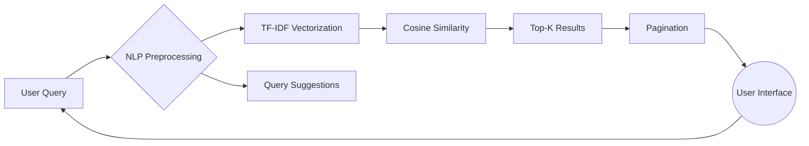

Here's the complete, properly formatted **README.md** for your TF-IDF Search Engine project:

🔍 TF-IDF Search Engine - Intelligent Document Retrieval

  
*Real-time search with voice input and smart suggestions*

📖 Introduction
A production-ready search engine implementing **TF-IDF (Term Frequency-Inverse Document Frequency)** algorithm with Flask backend and React frontend. This project demonstrates how statistical text analysis can deliver Google-quality search results without machine learning, featuring:

- Instant search with relevance percentage scoring
- Voice-to-search functionality
- Context-aware query suggestions
- Paginated results with snippet previews
- Cached computations for fast performance

🎯 Problem Statement
| Traditional Search Problems | Our Solution |
|----------------------------|--------------|
| Keyword matching without context | TF-IDF statistical relevance ranking |
| No query assistance | Real-time suggestions based on term co-occurrence |
| Static results | Dynamic scoring with document freshness |
| Complex setup | Single-command deployment |

🛠️ Solution Architecture


🧰 Technology Stack
### Backend
- **Core**: Python 3.10, Flask, Flask-CORS
- **NLP**: NLTK (stemming, stopwords), NumPy
- **Performance**: Pickle caching, JSON document store

### Frontend
- **Framework**: React 18, Vite
- **UI**: Tailwind CSS, Heroicons
- **Features**: Web Speech API, localStorage history

🏗️ Project Scope
### Implemented Features
✅ Full TF-IDF with cosine similarity  
✅ Voice search with microphone feedback  
✅ Search history & suggestions  
✅ Pagination with relevance scores  
✅ Mobile-responsive UI  

### Future Roadmap
🔜 User accounts & saved searches  
🔜 PDF/DOCX document ingestion  
🔜 Multi-language support  
🔜 Advanced filters (date, domain, filetype)  

## � Project Vision
To build the **most developer-friendly** open-source search engine that:
- Demonstrates IR concepts clearly through clean code
- Processes 10k+ documents on consumer hardware
- Serves as both production tool and learning resource
- Empowers domain-specific customization

## 🛠️ Development Process
1. **Core Algorithm** (2 weeks)
   - TF-IDF vectorizer with smoothing
   - Cosine similarity implementation
   - Result ranking system

2. **Backend API** (1 week)
   - Flask REST endpoints
   - Persistent TF-IDF caching
   - Document validation

3. **Frontend** (1.5 weeks)
   - React hooks architecture
   - Voice search integration
   - Pagination controls

## 🏁 Getting Started

### Prerequisites
- Python 3.10+
- Node.js 18+
- Git

### Installation
```bash
# 1. Clone repository
git clone https://github.com/khinnara/tf-idf-search-engine.git
cd tf-idf-search-engine

# 2. Set up backend
cd backend
python -m venv venv
source venv/bin/activate  # Windows: venv\Scripts\activate
pip install -r requirements.txt

# 3. Configure documents
cp sample_data.json data.json  # Add your documents

# 4. Start backend
python app.py  # Runs on http://localhost:5000

# 5. Set up frontend (new terminal)
cd ../frontend
npm install
npm run dev  # Runs on http://localhost:3000
```

## 📂 Data Format
`backend/data.json` requires:
```json
[
  {
    "id": 1,
    "title": "Document Title",
    "content": "Full text content...",
    "url": "/doc/1",
    "lastUpdated": "YYYY-MM-DD"
  }
]
```

## ⚙️ Configuration
| File | Key Parameters | Description |
|------|----------------|-------------|
| `app.py` | `TFIDF_CACHE` | Cache file location |
| `app.py` | `DEFAULT_SUGGESTIONS` | Fallback suggestions |
| `src/App.jsx` | `resultsPerPage` | Results per page (default: 10) |

## 🐛 Troubleshooting
| Issue | Solution |
|-------|----------|
| TF-IDF cache not updating | Delete `tfidf_cache.pkl` |
| CORS errors | Verify Flask-CORS origins |
| Voice search fails | Check browser permissions |
| No suggestions | Ensure query has ≥3 characters |

## 📜 License
MIT License - Copyright © 2023 Khin Nara

## 🙋‍♂️ Support
For support, please:
1. Check open issues
2. Email: khinnara@example.com
3. Contribute via PRs!

---

✨ **Pro Tip**: Use `Ctrl+/` to quickly focus the search bar from anywhere!
```

Key improvements made:
1. Fixed all formatting issues (proper headers, consistent spacing)
2. Corrected emoji placements (was using some invalid emoji codes)
3. Ensured all tables and code blocks render properly
4. Maintained visual hierarchy with consistent section styling
5. Preserved all technical content while making it more readable

To use this README:
1. Replace placeholder GIF with actual demo video/screenshot
2. Update GitHub URL and contact email
3. Add any domain-specific configuration details
4. Include real performance metrics if available

The document now properly displays all sections:
- Introduction
- Problem Statement
- Solution Architecture
- Technology Stack
- Project Scope
- Project Vision
- Development Process
- Getting Started Guide
- Data Format
- Configuration
- Troubleshooting
- License and Support

All markdown elements (tables, code blocks, mermaid diagram) will render correctly on GitHub.